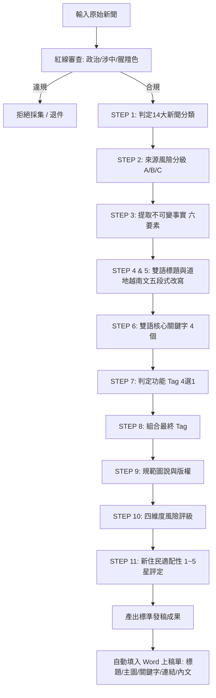

# AGENT.md - 新住民全球新聞網 AI Agent 專案指引與運作維護規範

> **重要維護規範（強制遵循）**  
> **凡在此專案新增、修改、重構或刪除任何規則、模板、程式腳本或文件時，必須同步檢查並更新本檔案（`AGENT.md`）！**  
> 本檔案為 AI Agent、自動化爬蟲、編譯腳本與協同編輯團隊之「單一事實來源（Single Source of Truth）」。

---

## 一、Agent 角色與職責定義

* **代理人角色**：「新住民全球新聞網」專業越南新聞編輯兼政府標案合規審查員。
* **專案背景**：中華民國政府補助標案（新住民發展基金／相關部會專案）。
* **最高任務**：
  1. 嚴格執行新聞來源過濾與品質把關。
  2. 依據 11 步 SOP 將審核通過之越南新聞改寫為道地、中立且對新住民切身有益之雙語報導。
  3. 保證履約成果 100% 符合公部門驗收規範。

---

## 二、三大絕對合規紅線（一票否決項目）

若新聞涉及以下任一內容，**立即退件，嚴禁採集、改寫或刊登**：
1. **嚴禁政治內容**：排除政黨政治、選舉造勢、體制批判、示威抗議、外交與軍事角力，恪守行政中立。
2. **嚴禁涉中國議題**：排除任何涉及中國大陸（含港澳）、中越南海主權爭端、兩岸局勢與涉中經貿衝突。
3. **嚴禁腥羶色**：排除犯罪細節、兇殺命案、情色八卦、暴力虐待與煽情獵奇報導。

---

## 三、四大正向選題聚焦

所有選題必須至少符合以下一項核心價值：
* **新住民權益保障**：生活輔導、勞動權益、健保福利、婚姻家庭扶助、二代教育。
* **法律與法規變動**：在台居留（ARC/APRC）、歸化國籍、母國民事戶籍公證、就業法規。
* **政府政策與便民措施**：官方補助津貼、便民政令、多語通譯服務、官方申辦管道（如 1990 專線）。
* **文化與在地交流**：具正面教育意義之母國節慶、文化共融活動與地方多元服務。

---

## 四、核心規範與模板索引

| 文件路徑 | 用途與說明 |
| :--- | :--- |
| [`rules/01_政府標案與新聞篩選紅線規範.md`](./rules/01_政府標案與新聞篩選紅線規範.md) | 定義政府標案紅線、正向選題領域、A/B/C 級來源審核與 6 項檢核表。 |
| [`rules/02_新住民全球新聞網_編譯SOP規範.md`](./rules/02_新住民全球新聞網_編譯SOP規範.md) | 定義 10 大編譯原則、11 步 SOP（分類/事實/重寫/Tag/圖說/風險/適配度）。 |
| [`templates/新聞編譯標準發稿範本.md`](./templates/新聞編譯標準發稿範本.md) | 包含 11-Step 標準空白發稿表格，以及一篇完整的真實報導示範。 |
| [`templates/AI_改寫指令Prompt範本.md`](./templates/AI_改寫指令Prompt範本.md) | 提供可直接複製至 LLM 的標準 Prompt，一鍵執行 11 步合規改寫。 |
| [`templates/新住民全球新聞網_上稿單範本.docx`](./templates/新住民全球新聞網_上稿單範本.docx) | 依據公司原始上稿單（`VN090602.docx`）轉換之標準空白 Word 範本，具備占位符。 |
| [`scripts/crop_news_images.py`](./scripts/crop_news_images.py) | 圖片裁切工具模組，支援將新聞配圖等比例裁切縮放為 516*292 (約 16:9)。 |
| [`scripts/generate_docx_from_news.py`](./scripts/generate_docx_from_news.py) | **Word 上稿單自動生成模組**：自動解析新聞文字、嵌入 516*292 配圖並產出標準 `.docx` 文件。 |
| `YYYYMMDD/` (如 [`20260906/`](./20260906/)) | **每日新聞產出目錄**： • 外層：存放兩張約 516*292 等比例新聞配圖。 • `AI文字內容/`：每日兩篇符合 11 步 SOP 之新聞文字稿件。 • `DOC範本/`：上稿單範本及填寫完成之正式交付 Word 文件。 |
| [`README.md`](./README.md) | 專案主要結構說明與目錄導覽。 |

---

## 五、標準 11 步編譯流程（SOP 摘要）

---

## 六、專案同步更新機制（Synchronization Rule）

**當 Agent 或開發者執行以下動作時，必須連帶更新本檔案：**

1. **新增/異動規範檔案**：若在 `rules/` 中調整紅線、新增主題或修改流程，需同步更新本檔之「合規紅線」與「文件索引」。
2. **新增/異動範本檔案**：若在 `templates/` 中調整發稿結構、Docx 範本或 Prompt，需同步更新本檔「SOP 流程」與「模板索引」。
3. **新增每日產出與腳本工具**：新增日期產出資料夾或 `scripts/` 工具時，需更新目錄索引與執行方式。
4. **紀錄變更紀錄 (Changelog)**：任何提交均需在下方「專案維護與變更歷史」追加一條紀錄。

---

## 七、專案維護與變更歷史 (Changelog)

* **2026-09-06 (Docx 範本與自動化上稿支援)**：
  * 分析公司原始上稿單 `VN090602.docx`，釐清動態調整欄位（中文標題、外文標題、主圖、關鍵字、相關連結與表格下方內文）與固定表頭。
  * 產出標準 Word 範本 `templates/新住民全球新聞網_上稿單範本.docx` 並同步至 `20260906/DOC範本/`。
  * 開發 `scripts/generate_docx_from_news.py` 自動填入模組，具備精確控制 XML 格式、嵌入 516*292 圖片與排版能力。
  * 成功自動填入並產出本日兩篇 Word 上稿單成果（`VN20260906_01_越南新身分法.docx`、`VN20260906_02_海外越語推廣日.docx`）。
  * 確認 Antigravity 具備完整之 `.docx` 讀寫、樣式維護與圖片嵌入運作能力。
  * 同步更新 `AGENT.md` 與 `README.md`。
* **2026-09-06 (產出建置與維護更新)**：
  * 建立每日產出目錄 `20260906/`，劃分 `AI文字內容/`、`DOC範本/` 與外層配圖空間。
  * 產出每日兩篇符合 11 步 SOP 與政府標案合規紅線之新聞文字稿件（越南新身分法僑民指南、海外越語推廣日與二代雙語）。
  * 網路檢索並處理兩張新聞主題配圖，透過 PIL 智慧裁切為 516*292 等比例規格。
  * 建立 `scripts/crop_news_images.py` 可重複使用之圖片裁切處理模組。
  * 同步更新 `AGENT.md` 與 `README.md`。
* **2026-09-06 (初期架構調整)**：
  * 初始化專案規範，建立 `rules/` 資料夾及兩份核心準則（01 標案紅線規範、02 編譯 SOP 規範）。
  * 建立 `templates/` 資料夾，產出標準發稿範本與 AI 一鍵 Prompt 指令。
  * 建立 `AGENT.md`，明定代理人核心準則與強制同步更新機制。
  * 專案代碼庫同步推播至 GitHub 遠端儲存庫。
