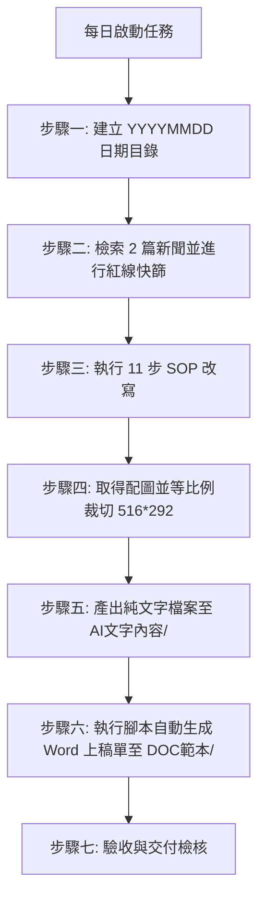

# 每日越南新聞採編與上稿自動化工作流程 (Daily News Workflow)

本 Skill 定義「新住民全球新聞網」每日 2 篇越南新聞自採集、審核、改寫、配圖處理到 Word 上稿單自動生成之標準執行流程。

> **規範依據**  
> 本流程之審查門檻、三大紅線、文字純黑排版與格式標準，嚴格依據 [`rules/專案採編與上稿唯一權威規範.md`](../../rules/專案採編與上稿唯一權威規範.md) 執行。

---

## 一、工作流概覽 (Workflow Pipeline)



---

## 二、詳細作業步驟

### 步驟一：建立日期產出目錄結構
以當日年月日（`YYYYMMDD`，例如 `20260906`）在專案根目錄下建立專屬資料夾，內部包含：
1. `YYYYMMDD/AI文字內容/`：存放當日產出之純文字稿（`.txt`）。
2. `YYYYMMDD/DOC範本/`：存放填寫完成之正式交付 Word 文件（`.docx`），**不放空白範本或重複說明檔**。
3. `YYYYMMDD/`（外層）：存放兩張 516*292 配圖。

---

### 步驟二：新聞選題與紅線快篩審核
針對當日越南主流媒體（VnExpress、Tuổi Trẻ、VietnamPlus 等）或官方機關發布之新聞進行篩選：
1. **三大一票否決紅線核對**：
   * ❌ 無政治敏感、政黨爭端、意識形態批判、示威遊行。
   * ❌ 無涉中國議題（含南海主權、兩岸問題、中越邊境爭端）。
   * ❌ 無腥羶色、犯罪細節、命案兇殺、名人緋聞八卦。
2. **正向選題聚焦確認**：
   * 聚焦於：新住民生活權益、居留/國籍法律法規、政府便民政策、母國重大文教交流。
3. **來源等級確認**：
   * 必須為 A 級（官方）或 B 級（主流正規媒體），取得**原始真實 URL 網址**。

---

### 步驟三：執行 11-Step 標準編譯 SOP
每篇新聞必須完整執行以下 11 步改寫程序：
* **STEP 1｜新聞分類**：從 14 大類別中勾選對應分類（如政策公告、勞工權益、文化藝術等）。
* **STEP 2｜來源風險分級**：標記 A 級或 B 級，並附上原始官方/媒體名稱與原始 URL 連結。
* **STEP 3｜不可變事實整理**：提取日期、地點、人物、機關、數字、核心事件（確保事實無誤）。
* **STEP 4 & 5｜雙語標題與五段式越南文內文改寫**：
  * 中文標題（20~30 字，客觀敘事，先事件後影響）。
  * 越南文標題（20~30 字，道地越南新聞風格）。
  * 越南文內文（標準五段式，道地 *Tiếng Việt tự nhiên*，無機器翻譯感）：
    * 第 1 段（導言，50~70 字）：說明發生何事、在哪裡、為何重要。
    * 第 2 段（事件內容）：詳細經過、數據、官方說法。
    * 第 3 段（影響）：對民眾、新住民或社會之影響。
    * 第 4 段（後續措施）：政府政策、措施或未來時程。
    * 第 5 段（背景）：歷史背景或延伸資訊。
* **STEP 6｜雙語主題關鍵字**：中文與越文各提供 4 個關鍵字。
* **STEP 7｜功能 Tag 判定**：從 `🌏母國資訊`、`⚠️權益提醒`、`📍在地資訊`、`✈️旅遊資訊` 中擇一標註並說明理由。
* **STEP 8｜最終 Tag 組合**：格式為 `主題1、主題2、主題3、主題4、功能Tag`。
* **STEP 9｜五語圖說格式**：**強制使用標準格式** `主圖說明(Ảnh envato/{圖片名稱})`（不加最外層大括號）。
* **STEP 10｜SOP 風險評級**：評估侵權風險、來源可信、敏感度、發布風險及原因。
* **STEP 11｜新住民全球新聞網適配性**：評定 1~5 星級並簡述生活、政策、權益指標。

---

### 步驟四：新聞配圖檢索與等比例智慧裁切
1. 從公開版權圖庫或新聞主題相關之公開圖片取得配圖。
2. 使用專案裁圖模組 [`scripts/crop_news_images.py`](../../scripts/crop_news_images.py)：
   * 智慧等比例裁切縮放為 **516 × 292**（約 16:9）比例。
   * 儲存於 `YYYYMMDD/` 外層，命名範例：`20260906_新聞01_越南新身分法換證配圖.jpg`。

---

### 步驟五：產出純文字檔案
將 11-Step SOP 成果輸出為純文字檔案，存放於 `YYYYMMDD/AI文字內容/`：
* 檔案命名：`YYYYMMDD_新聞稿01_[主題].txt` 與 `YYYYMMDD_新聞稿02_[主題].txt`。
* **關鍵核對**：來源連結欄位必須為**原始真實 URL 網址（例如：`https://tuoitre.vn/...`）**，嚴禁填入越文說明文字。

---

### 步驟六：自動化生成正式 Word 上稿單
執行專案 Word 上稿單自動生成模組：
```bash
python scripts/generate_docx_from_news.py
```
* 模組將自動：
  1. 讀取 `templates/新住民全球新聞網_上稿單範本.docx`。
  2. 將中文標題、外文標題、關鍵字填入對應欄位（**純黑字體，無紫色網底與螢光色**）。
  3. 將 516*292 配圖等比例嵌入「主圖」左側儲存格。
  4. 將圖說以 `主圖說明(Ảnh envato/{圖片名稱})` 填入主圖右側。
  5. 將原始 URL 網址填入「相關連結」欄位，並**同步更新底層超連結目標 (Relationship Target URL)**。
  6. 執行超連結一致性審核斷言（Assert），確保底層連結目標與顯示網址完全吻合。
  7. 將五段越南文新聞內文排版填入表格下方（Times New Roman 12pt、段前段後 12pt、行距 1.15 倍）。
  8. 輸出至 `YYYYMMDD/DOC範本/VN[日期]_[序號]_[主題].docx`。

---

### 步驟七：交付驗收檢查清單 (Checklist)

產出後逐項確認：
- [ ] 兩篇新聞皆符合三大紅線（無政治、無涉中、無腥羶色）。
- [ ] 配圖尺寸精準為 516*292 等比例。
- [ ] `AI文字內容/` 內有兩篇完整的 11 步 SOP 文字檔。
- [ ] `DOC範本/` 內有兩份正式 Word 文件，且無底色、文字純黑。
- [ ] Word 內「相關連結」為原始真實 URL 網址，底層超連結目標與文字完全一致且與文章內容相符。
- [ ] 主圖圖說符合 `主圖說明(Ảnh envato/{圖片名稱})` 格式（無外層大括號）。
- [ ] `DOC範本/` 內無重複放置之空白範本或說明文件。
